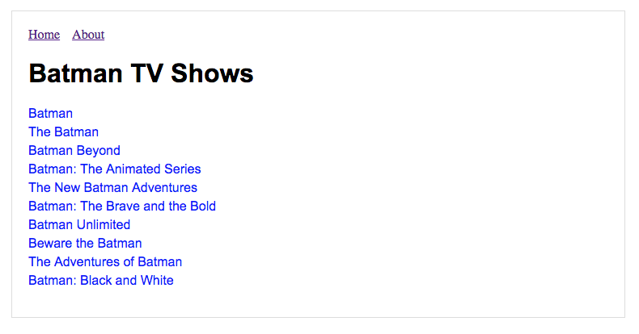
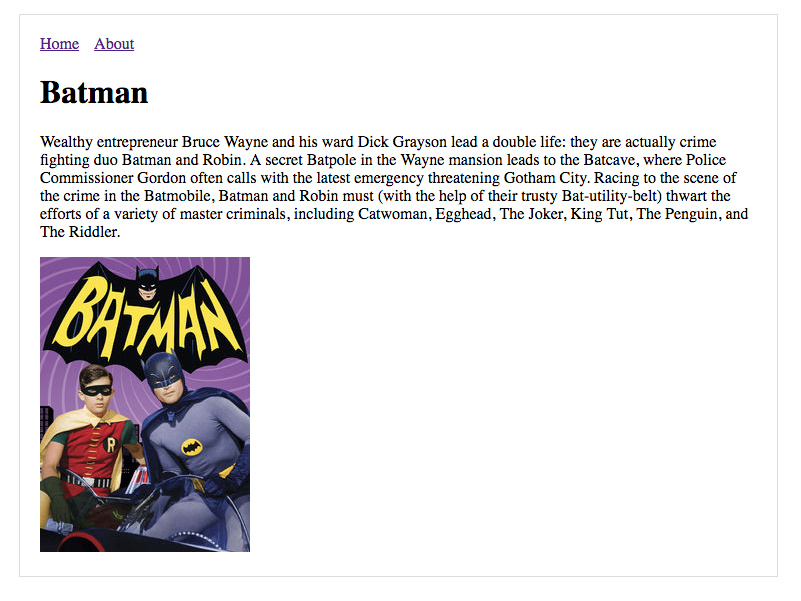

# Next.js Batman tutorial

> [Next.js Batman tutorial](https://nextjs.org/learn/) with dynamic routes and deployment examples.

## Deployment

| Service                   | Branch             | PR   | Demo |
|---------------------------|--------------------|------|------|
| Heroku                    | [heroku]           | [#1] |  |
| Now (`@now/next`)         | [now-next]         | [#2] |  |
| Now (`@now/static-build)` | [now-static-build] | [#3] |  |
| GitHub Pages              | [github-pages]     | [#4] |  |

[heroku]: https://github.com/amercier/hello-next/tree/heroku
[now-next]: https://github.com/amercier/hello-next/tree/now-next
[now-static-build]: https://github.com/amercier/hello-next/tree/now-static-build
[github-pages]: https://github.com/amercier/hello-next/tree/github-pages
[#1]: https://github.com/amercier/hello-next/pull/1
[#2]: https://github.com/amercier/hello-next/pull/2
[#3]: https://github.com/amercier/hello-next/pull/3
[#4]: https://github.com/amercier/hello-next/pull/4

See [Pull Requests](https://github.com/amercier/hello-next/pulls) for all examples.

## License

